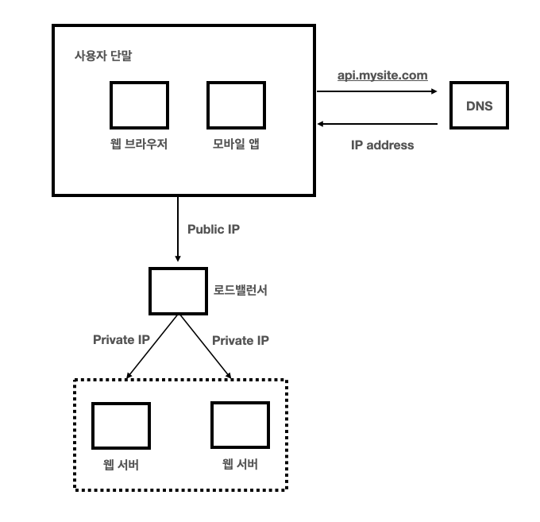

#### 그림 가져온 블로그 
https://dream-and-develop.tistory.com/274  
https://velog.io/@haron/%EA%B0%80%EC%83%81-%EB%A9%B4%EC%A0%91-%EC%82%AC%EB%A1%80%EB%A1%9C-%EB%B0%B0%EC%9A%B0%EB%8A%94-%EB%8C%80%EA%B7%9C%EB%AA%A8-%EC%8B%9C%EC%8A%A4%ED%85%9C-%EC%84%A4%EA%B3%84-%EA%B8%B0%EC%B4%88-1%EC%9E%A5-%EC%82%AC%EC%9A%A9%EC%9E%90-%EC%88%98%EC%97%90-%EB%94%B0%EB%A5%B8-%EA%B7%9C%EB%AA%A8-%ED%99%95%EC%9E%A5%EC%84%B1

# 1장. 사용자 수에 따른 규모 확장성 

1장에서는 1명의 사용자를 지원하는 시스템에서부터, 최종적으로 수백만명의 사용자를 지원하는 시스템 설계를 목표로 함.

아래 흐름으로 시스템 아키텍처를 개선해나감  
1. 단일 서버 
2. 데이터베이스 분리 
3. 로드밸런서 추가
4. 데이터베이스 다중화.
5. 캐시/CDN 추가 (지연 시간 감소)
6. Stateless 구조 (웹 계층)
7. 데이터 센터 다중화
8. MQ 추가
9. 로깅/메트릭/자동화 도구 추가
10. 데이터베이스 Scale-Out

## 01. 단일 서버
모든 컴포넌트 (웹, 앱, 데이터베이스, 캐시 등)이 단 하나의 서버에서 실행되는 시스템 

### 단일 서버 아키텍처

### 단일 서버 아키텍처에서 요청 흐름
1. 사용자가 Domain Name을 이용해 웹 사이트에 접속 시도.
    - 이 과정에서 DNS를 통해, IP 주소 변환 과정이 필요
    - 보통 DNS는 third party이므로 단일 서버엔 포함 X
2. DNS결과로 IP 주소 반환 
3. 해당 IP 주소로 HTTP 요청 
4. 웹 서버가 HTML 페이지나 JSON 등의 응답 반환

## 02. 데이터 베이스
사용자가 증가하면 위와 같은 단일 서버로는 충분하지 않아, 여러 서버(2개)를 둬야 함.

하나의 서버는 웹/모바일 트래픽 처리용(웹 계층), 다른 하나는 데이터 베이스용(데이터 계층).  
이렇게 웹 계층과, 데이터 계층으로 분리하면, 각각을 독립적으로 확장이 가능해짐. 

### 단일 서버 -> 데이터 베이스 분리 후 아키텍처

### 어떤 데이터 베이스를 사용해야 할까?
보통 개발자들은 RDBMS를 구축하는 경우가 많은데, 익숙하기 떄문임. 
아래와 같은 경우에는 NoSQL을 선택하는 게 바람직함.
(언제 RDBMS를 선택해야하는지는 안적혀있음)

1. 아주 낮은 지연시간 요구
2. 다루는 데이터가 비정형인 경우 (관계형으로 표현 X)
3. 데이터를 직렬/역직렬화 만 하는 경우 
4. 아주 많은 데이터를 저장하는 경우

## 03. Scale Up vs Scale Out

### Scale Up
CPU, Ram 등을 추가하는 방법  
  
서버로 유입되는 트래픽 양이 적을 때, 가장 단순하게 성능 개선이 가능

#### Scale Up 단점 
- 한 대의 서버에 CPU, 메모리를 무한대로 증성 불가 
- 장애 복구(fail-over), 다중화 방안 X 

이러한 단점 때문에, 대규모 애플리케이션에는 Scale Out을 사용

### Scale Out
더 많은 서버를 추가하는 방법 

### 로드 밸런서 (웹 계층 개선 - Scale Out)
부하 분산 집합에 속한 웹 서버들에게 트래픽을 고르게 분산하는 역할  

  

  
- 사용자는 로드밸런서의 공개 IP로 접속  
- 웹 서버는 직접 트래픽을 처리하지 않음  
- 보안을 위해 서버 간 통신에는 사설 IP를 사용하고, 로드 밸런서도 내부 서버와 통신을 위해 사설 IP로 통신 
  
로드 밸런서가 관리하는 분산 집합에 웹 서버를 추가하면, Fail over가 가능해지고, 가용성이 증가함. 
- fail-over => 하나의 웹 서버가 다운되면, 다른 웹 서버로 트래픽이 이동
- 가용성 -> 트래픽이 급증하면, 웹 서버를 더 추가하면 로드밸런서가 트래픽을 자동으로 분산함  

### 데이터 베이스 다중화 (데이터 계층 개선 - Scale Out)
DBMS는 자체적으로 Master-Slave 관계로 다중화 지원. 

Master
- 데이터 원본 저장 
- Write/Read 지원

Slave
- 데이터 사본 저장 
- Read 연산만 지원  

대부분의 데이터베이스 시스템은 Write연산 보다, Read연산이 많으므로, Slave 데이터베이스 수가 Master보다 많음. 

#### 데이터베이스 다중화의 장점 
1. 성능 
    - Read연산이 다중화 된 Slave로 분산되므로, 병렬처리 가능
2. 안정성 
    - 일부가 파괴되어도 데이터는 다중화 됨  
3. 가용성 
    - 장애가 발생해도 다른 서버의 데이터 가져옴 

#### 만약, 데이터 베이스 서버 중 하나가 다운된다면? 
1. 만약 Slave 서버가 1개인데, 다운된 경우 
    - Read 연산은 모두 Master 서버가 처리
    - 새로운 Salve 서버 생성 후 대체 
2. Salve 서버가 여러개인데, 1개가 다운된 경우 
    - 나머지 Salve 서버가 처리 
3. Master 서버가 다운됐는데, Slave가 1개인 경우 
    - Slave가 새로운 Master로 승격
    - 모든 연산은 새로운 Master가 처리
    - 새로운 Slave 생성
    - 실제 운영환경에서는 Slave가 가진 데이터가 항상 최신이 아니기 떄문에 복구 스크립트가 필요. 

### 로드 밸런서 + 데이터 베이스 다중화 까지 완료한 아키텍처
  

### 위 아키텍처에서의 요청 흐름 
1. 사용자는 DNS로 부터 로드밸런서의 공개 IP 주소 획득
2. 사용자가 공개 IP주소로 로드밸런서 접속 
3. HTTP 요청이 서버1/2로 전달 
4. 웹서버가 사용자의 데이터를 Slave 데이터베이스에서 읽음
5. 웹서버가 Master 데이터베이스에 CRUD 수행 

## 04. 캐시 - 응답속도 개선 
오래 걸리는 연산 결과 OR 자주 참조되는 데이터를 저장하는 저장소  
보통, APP 성능은 데이터베이스 호출 빈도에 의존하는데 이를 해결할 방법 

### 캐시 계층 
캐시를 별도 계층으로 분리하면, 캐시도 독립적으로 Scale Out 가능 
캐시 계층을 이루는 캐시서버는 보통 API를 통해 사용 

### 캐시 사용시 유의할 점 
- 갱신빈도는 낮고, 참조 빈도는 높을 때 유리
- 휘발성 데이터이므로 중요한 데이터는 비휘발성 저장소에 저장해야함
- 적절한 데이터 만료 정책
- 일관성 -> 데이터베이스, 캐시 갱신 연산은 하나의 트랜잭션으로 관리 
- 장애 대응  -> 여러 지역에 캐시 서버 분산 필요 
- 메모리 크기 -> 너무 작으면 성능 하락 
- 데이터 방출 정책 -> LRU가 가장 많이 사용되지만, 경우에 맞게 적용 필요 

## 05. CDN 
정적 콘텐츠(이미지, 비디오, css, js 등)을 캐싱, 전송하는데 쓰이는 지리적 분산 네트워크.  
  

특정 웹사이트에 접속 시, 가장 가까운 CDN이 정적 콘텐츠를 전달. 

### CDN 동작 방법 
흐름은 일반적인 캐시 서버와 동일  

1. 사용자가 CDN URL로 이미지 파일 요청 
2. 캐시 hit 안되는 경우 CDN서버가 원본 서버에 접근해 파일 획득 
3. 응답 HTTP 헤더에 존재하는 TTL 만큼 CDN 서버에 저장하고, 이미지 파일 사용자에게 반환
4. 다른 사용자가 이미지를 요청하는 경우, CDN 캐시 HIT 

### CDN 사용 시 고려할 사항 
1. 비용 
    - 보통 CDN은 third-party이므로, 데이터 전송량에 따라 비용 산정됨 
    - 자주 사용되지 않는 콘텐츠는 CDN 이용 지양 
2. 적절한 TTL 
3. CDN 장애 대응 
    - CDN에 장애 발생시, 원본 서버로 요청하도록 클라이언틀르 구성해야함 
4. 콘텐츠 무효화 방법 (콘텐츠 업데이트 시)
    - 아직 TTL에 도달하지 않은 컨텐츠를 제거하는 방법 
    - API로 직접 무효화 
    - 버저닝으로 무효화 

### 캐시 + CDN 추가한 아키텍처
- static 콘텐츠는 CDN으로 서비스
- 캐시가 DB 부하 감소  

## 06. Stateless 웹 계층 
웹 계층을 수평적으로 확장하기 위해선 상태정보를 웹 계층에서 제거해야 함.  
보통, 데이터베이스에 상태를 저장하고 가져오는데 이렇게 구성한 계층을 Stateless 웹 계층이라 함. 

### Stateful 아키텍처 
State를 저장하는 서버는 상태를 저장해 요청들 사이에서 공유하도록 함.
이 경우, State는 특정 서버에만 저장되어, 특정 사용자에 대한 요청은 특정 서버로만 전송되어야 함.
  
이를 지원하기 위해 로드밸런서는 고정 세션을 사용하는데, 성능에 악영향을 줌. 
또한, 서버를 추가하거나, 제거, 장애 처리에 복잡함을 추가함.  

### Stateless 아키텍처

이 구조에선, 웹 서버로부터 분리된 저장소에서 상태정보를 가져오기 떄문에, 여러 사용자의 HTTP 요청이 어떤 서버로든 갈 수 있음. 
  
상태가 웹 서버로부터 분리되어 단순하고, 안정적이고, Scale out이 쉬움 

### Stateless 추가한 아키텍처 -> Web 서버 Scale-Out

그림에서는 세션 데이터를 NoSQL에 저장. 
공유 저장소를 NoSQL로 설정 한 이유는 Scale-Out이 간편해서.  
  
이 구조에서는 Stateless이므로 웹 계층을 트래픽 양에 따라 유연하게 추가/제거만 하면 자동으로 Scale-Out이 가능.  

## 07. 데이터 센터 
앞선 구조에 더 나아가, 가용성을 높이고 전세계에서 빠르게 접근하기 위해 데이터 센터를 추가.

### 데이터센터가 2개인 경우

장애가 없는 경우는 GeoDNS Routing이 됨. 

GeoDNS Routing
- 장애가 없는 경우 가장 가까운 데이터 센터로 라우팅하는 절차 

GeoDNS
- 위치에 따라 어떤 IP주소로 반환할지 결정하는 DNS
   

만약, 장애가 발생하면, 두 개 데이터센터중 하나로 모든 트래픽이 전송됨. 

### 다중 데이터 센터를 만드려면..  

1. 트래픽 우회 
    - 어떤 데이터 센터로 보낼지 결정해야 함
    - GeoDNS는 그 중 하나의 방법 
2. 데이터 동기화 
    - 만약, 장애가 복구된다면 장애가 발생한 데이터센터의 데이터베이스는 데이터가 없을 수 있음 
    - 이 경우, 보편적인 전략은 데이터를 여러 데이터 센터를 거쳐 다중화 하는 것 (Master-Slave)
3. 테스트/배포 
    - 다른 데이터센터에서도 테스트/배포를 모두 진행해야 함.

## 08. 메시지 큐 
메시지의 무손실을 보장하는 비동기 통신 컴포넌트.  
서비스간 결합이 느슨해져 Scale Out에 유리해짐.  
  
비동기 기반이기 때문에, Producer, Consumer가 서로 의존하지 않고 하나가 다운되더라도 메시지 송신/수신이 가능 

프로세스의 특정 과정에서 시간이 오래걸리는 프로세스에서 유리함.  

프로세스의 특정 과정을 담당하는 컴포넌트 들을 메시지 양에 따라 독립적으로 Scale-Out, in 할 수 있기 떄문. 

## 09. 로그, 메트릭 그리고 자동화 

### 로그 
서버 단위로 할 수도 있지만, 로그를 단일 서비스로 모아서 처리하는 도구를 활용 => 검색/조회 편리 향상 

### 메트릭 
시스템의 현재 상태 확인.. 
  
호스트 단위 메트릭: CPU/메모리 등 
종합 메트릭: DB 성능/캐시 성능 등 
핵심 비즈니스 메트릭: 일별 사용자/재방문 등

### 자동화 
CI/CD.. 개발 생산성을 높이는 도구들 

### MQ, 로그, 메트릭, 자동화 반영 아키텍처 
- MQ가 각 컴포넌트들 결합도를 줄임 
- 로그, 모니터링 등을 지원하기 위한 툴 추가 

## 10. 데이터베이스 규모 확장 
데이터 증가 -> 데이터베이스 부하 증가 -> 증설 필요 

데이터 베이스 또한 Scale Up 또는 Scale Out 중 하나로 규모를 확장해야 함.  

  
### 데이터베이스 Scale Up
당연히 고성능일 수록, 많은 양의 데이터를 보관/처리 가능.  

예를 들어 StackOverflow에서는 한 해동안 방문한 1000만명의 사용자를 하나의 Master 서버로 처리함 
  
하지만, 단점 
1. 무한 증설 불가 -> 결국 언젠가는 한계 
2. SPOF(single point of Failure) 위험성 
3. 고비용 

### 데이터 베이스 Scale Out (샤딩)
데이터 베이스를 샤드 단위로 분할하는 기술  
모든 샤드는 같은 스키마를 사용하지만, 저장되는 데이터 사이에 중복은 없음  

특정 사용자를 어느 샤드에 저장할지는 사용자 ID를 통해 결정하는 경우 아래 그림과 같이 분산/저장됨.

샤딩 키는 하나 이상의 Column으로 구성됨.  

만약 데이터를 여러 샤딩에 고르게 분할되도록 샤딩키를 선택한다면 효율을 높일 수 있고, Scale Out을 실현할 수 있음.  

  

  

### 샤딩 사용 시 기술적 문제  
1. 데이터 Re 샤딩 
    - 데이터가 너무 많아져 샤드 증설이 필요할때 
    - 특정 샤드 공간이 빠르게 소진될 떄 
    - 이런 경우, 샤드 키를 계산하는 함수를 변경하고, 데이터 재배치가 필요함 
    - (5장) 안정 해시 기법이 해결책 
2. Celebrity 문제 (Hotspot 키 문제) 
    - 특정 샤드에 질의가 집중되어 과부하가 발생하는 문제 
    - 유명인 데이터가 모두 같은 샤드에 존재할 때, 해당 샤드에 과부하
    - 해결책은 유명인을 쪼개거나, 샤드를 더 잘게 나눠야함  
3. Join/비정규화 
    - 여러 샤드 데이터가 분리되면 Join이 어려워짐 
    - 해결법은 비정규화를 통해 하나의 테이블에서 쿼리 실행되도록 ..

### 샤딩을 적용한 아키텍처 
앞선 아키텍처에서 RDBMS가 필요없는 부분은 NoSQL로 이전 (부하 감소)

  
## 11. 백만 사용자, 그리고 그 이상 
시스템 규모 확장은 지속적/반복적인 과정.  
  
수 백만 사용자까지 지원하기 위해서는 지속적으로 시스템을 확장해 나가야 함.. 

## 1장 정리 
1. 웹 계층은 Stateless로..  => Scale-Out/AutoScaling
2. 모든 계층에 다중화 도입 => 가용성/안정성/Fail-over ... 
3. 가능한 많은 데이터 캐시 => 지연시간 
4. 여러 데이터 센터 => 가용성/안정성/낮은 지연시간 등
5. 정적 콘텐츠는 CDN => 지연시간
6. 데이터 계층은 샤딩을 통해 Scale-Out 
7. 각 계층은 독립적으로 분리할 것 => Scale-Out/의존성 감소
8. 모니터링/자동화도구