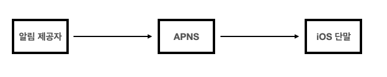
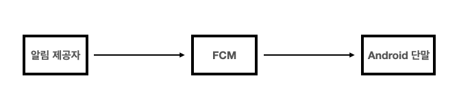
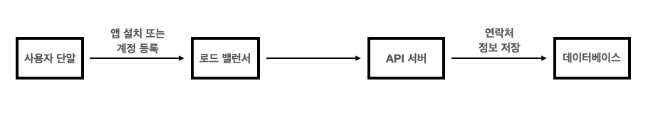
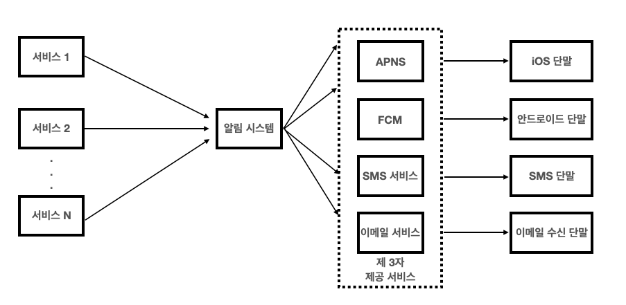
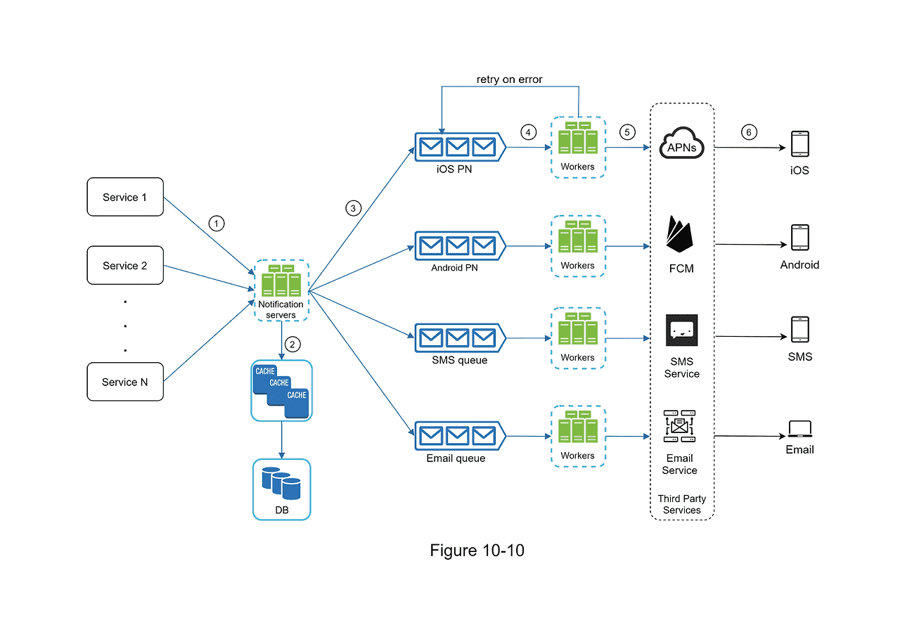
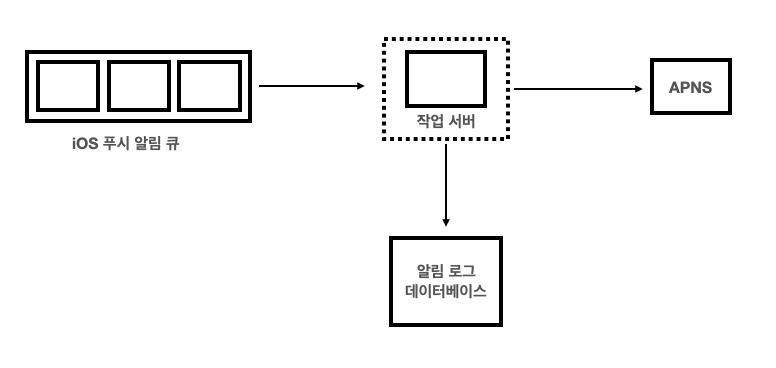
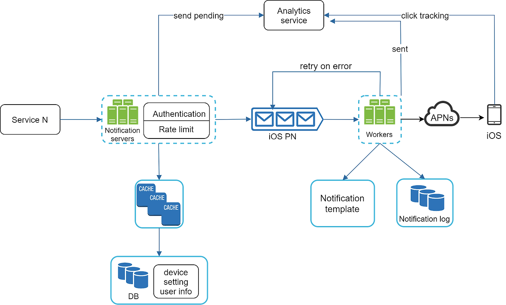

# 10장 알림 시스템 설계

## 🏁 intro

### ✅ 알림 시스템?
- 업데이트, 이벤트, 선물 등 고객에게 정보 제공 
- 비동기 시스템 
- 모바일 푸시 알림, SMS 메시지, 이메일 

## 🏁 1단계 | 문제 이해 및 설계 범위 확정

### ✅ 요구사항 파악 및 설계 범위
1. 알림 종류
- 🙋:  알림은 어떤 종류..?
- 👨‍💻: 푸시 + SMS + 이메일 

2. 실시간 여부 
- 🙋: 실시간 시스템인가용? 
- 👨‍💻: 실시간이지만, 약간의 지연 발생 허용 (soft-realtime)

3. 지원 단말 
- 🙋: 지원 단말은 어떻게..?
- 👨‍💻: IOS, 안드로이드, 랩톱/데스크톱

4. 알림 생성 주체 
- 🙋: 알림은 누가 만드나요? 
- 👨‍💻: 서버 스케줄링 OR 클라이언트 어플리케이션 

5. 알림 미수신
- 🙋: 알림 안받게 설정가능?
- 👨‍💻: 설정 가능 

6. 1일 트래픽 
- 모바일 푸시: 1000만건
- SMS 메시지: 100만건
- 이메일: 500만건

## 🏁 2단계 | 개략적인 설계안 제시 및 동의 구하기

## 📍 알림 유형별 동작 방식 📍

### ✅ 1. IOS 푸시 알림

3가지 컴포넌트 필요 

#### 1. 알림 제공자
    - 알림 요청을 생성해 APNS로 보내는 역할

    - 단말 토큰과 페이로드를 통해 알림 요청 생성 

#### 2. APNS
    - 애플이 지원하는 원격 서비스 

    - 푸시 알림을 IOS 기기로 전송 
#### 3. IOS 단말 

### ✅ 2. 안드로이드 푸시 알림 

IOS와 동일하지만,  

APNS 대신, FCM (firebase cloud messaging)을 사용 

### ✅ 3. SMS 메시지

알림 제공자 -> SMS 서비스 -> SMS 수신 단말  

제 3 사업자 서비스 (상용서비스) 사용

### ✅ 4. 이메일
  
알림 제공자 -> 이메일 서비스 -> 이메일 수신 단말

회사별 고유 이메일 서버를 구축하는 건 가능하나,  

대부분 상용 이메일 서비스 사용  
전송 성공률, 데이터 분석 서비스 떄문에

## 📍 연락처 정보 수집 절차  📍

- 알림에 필요한 단말 토큰, 이메일 주소, 전화번호 등을 수집하는 절차 
- 앱 설치 OR 계정 등록 시 수집해 DB에 저장
- [이메일, 전화번호]는 user 테이블, 단말 토큰은 device 테이블에 저장

## 📍 개략적 설계안 - 초안  📍

### 시스템 구성 컴포넌트

#### ✅ 1. 1~N 서비스 
    - 알림을 보내고자 하는 서비스

    - 과금 서비스, 배송 알림 서비스 등

    - 각 서비스는 microservice, 크론잡, 분산시스템 등으로 구성될 수도 

#### ✅ 2. 알림 시스템
    - 알림 전송/수신 처리 역할

    - N 서비스에 알림 제공 API 제공 
    
    - 제 3서비스에 전달할 Payload 생성

    - 초안에서는 서버가 1개라고 가정  

#### ✅ 3. 제3자 서비스
    - APNS (IOS), FCM (안드로이드) 등 사용자에게 알림을 실제로 전달 하는 역할
    
    - 확장성 고려해야 함
    
    -  중국에서는 FCM을 사용할 수 없고 다른 제3자 서비스 사용

    => 삭제/추가가 쉬워야 함

#### ✅ 4. IOS, 안드로이드, SMS, 이메일 단말 

### 문제점 

모두 알림 시스템 서버가 1개라 발생하는 문제점들
#### ✅ 1. SPOF
    - 알림 시스템 서버에 장애가 있으면, 전체 알림 서비스에 장애 발생
#### ✅ 2. 규모 확장성 
    - DB, 캐시 등 중요 컴포넌트 규모를 개별적으로 확장 불가 
#### ✅ 3. 성능 병목 
    - 사용자 트래픽이 몰리면 과부하

## 📍 개략적 설계안 - 개선  📍

#### ✅ 1. 알림서버 개선
    - 1개 -> 오토 스케일링 가능한 구조로 개선 
    
    - DB, 캐시 분리
    
    - 추가 기능
        
        - 알림 전송 API: 스팸 방지를 위해 인증된 클라이언트만 이용가능
        
        - 알림 검증: 이메일, 전화번호 등에 대한 검증
        
        - DB, 캐시 질의
        
        - 알림 전송: 메시지 큐에 데이터 넣기

#### ✅ 2. 캐시 추가 
    - 사용자 정보, 템플릿 등을 캐시 
#### ✅ 3. DB 
    - 사용자, 알림, 설정 등 알림에 필요한 정보 저장 

#### ✅ 4. 메시지 큐 추가 
    - 알림 종류 별로 큐 사용 
    
    - 다량의 알림 발생 시 버퍼 역할
    
    - 시스템 컴포넌트 간 의존성을 제거해, 제3자 서비스 확장성 확보 
    
    - 제3자 서비스 장애 발생하더라도 다른 3자 서비스 정상 동작

#### ✅ 5. 작업 서버 분리
    - 알림을 꺼내, 제3자 서비스로 전달하는 역할

### ✅ 알림 전송 순서
    1. N 서비스에서 API 호출해, 알림 서버 호출
    
    2. 알림 서버에서 DB, 캐시를 조회해 메타데이터 획득
    
    3. 알림서버에서 이벤트 생성 후 메시지 큐에 삽입
    
    4. 작업서버가 메시지 큐에서 꺼냄
    
    5. 작업서버가 제3자 서비스에 전달 
    
    6. 제 3자 서비스가 사용자 단말에 전송 

## 📍 상세 설계  📍
안정성, 추가 필요한 컴포넌트 고려 

### 📍 안정성  📍

#### ✅ 데이터 손실 방지

    - 요구 사항: 지연 ok, 손실 no 
    
    - 알림 데이터를 DB에 보관하고, 재시도 메커니즘 구현 

#### ✅ 알림 중복 방지 
    - 분산 시스템에서 알림 중복을 100% 막는건 불가능
    
    => 예시 1) 데이터를 수신하지 못한 경우
    
    패킷 유실등의 이유로 클라이언트가 수신하지 못하는 경우, 서버에선 중복해서 알림을 보내게 됨 

    => 예시 2) 수신하였지만, 회신을 못보내는 경우

    패킷 유실, 어플리케이션 오류 등의 이유로 회신을 보내지 못하는 경우, 중복해서 알림을 보내게 됨

    - 중복 빈도를 줄이기 위한 방법
    
    - 중복 탐지 메커니즘 도입
        
        - 알림에 이벤트 ID 할당 후 검사
        
        - 동일하다면 버림

### 📍 추가 가능한 컴포넌트  📍

#### ✅ 알림 템플릿
    - 대부분 알림은 유사하니, 템플릿을 통해 재사용 
    
    - Parameter, 스타일, Link 조정만 진행 

    - 효과: 알림 형식 일관성 + 오류 감소 + 알림 작성 시간 감소

#### ✅ 알림 설정 
    - 사용자가 알림 수신 설정을 조정하는 기능
    
    - 알림 설정 테이블에 설정 정보 저장 
    
    - 알림 전송 전 사용자 설정 조회

#### ✅ 전송률 제한

    - 너무 많은 알림이 가지 않도록 알림 빈도 조절 

#### ✅ 재시도 방법

    - 전송 실패 시, 재시도 큐에 넣기
    
    - 계속 실패 시, 개발자에게 통지

#### ✅ 보안
    - 인증, 승인된 클라이언트만 알림 API를 사용할 수 있도록 

#### ✅ 큐 모니터링
    - 큐에 쌓인 알림 갯수를 모니터링 하는 메트릭 추가 

    - 큐 적체가 심할 경우 작업서버 증설

#### ✅ 이벤트 추적

    - 알림 확인율, 클릭율, 앱사용을 추적

    - 데이터 분석 서비스에서 이벤트 추적 기능을 제공하니, 데이터 분석 서비스와 통합하는걸 추천

## 📍 최종 설계안  📍

    - 알림서버: 인증, 전송률 제한 컴포넌트 추가
    
    - 재시도 메커니즘: 실패 시 큐 삽입 후, 재시도 카운트 만큼 진행
    
    - 전송 템플릿 추가

    - 모니터링, 이벤트 추적 시스템 추가 
